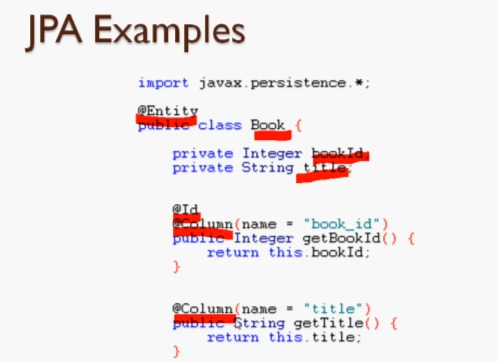

# Créer des classes de modèles

+ Introduction à JPA et Hibernate
+ Créer manuellement une classe de modèle
+ Générer des classes de modèles à l'aide de l'outil d'ingénierie inverse Hibernate
+ Cours de modèles :
  + Utilisateurs (Users),
  + Catégorie (Category),
  + Livre (Book),
  + Client (Customer),
  + Revue (Review),
  + Commande de livre (BookOrder)
  + Détail de la commande (OrderDetail).

## API de persistance Java (JPA)

+ JPA est une spécification d'API Java pour la gestion des données relationnelles dans les applications utilisant Java SE et JAVA EE.
+ Version utilisée : JPA 2.1
+ Forfait API:
  + `javax.persistence`
+ Langage de requête de persistance Java (JPQL)
+ Implémentations : Hibernate, EclipseLink, OpenJPA.



**Query**

```
    SELECT b FROM Book b ORDER BY b.title
```

## Cadre de mise en veille prolongée

+ Hibernate est un framework de mappage objet-relationnel
+ Hibernate est une implémentation (ou fournisseur) de JPA
+ Hibernate ORM : Core
  + Persistance du modèle de domaine pour les bases de données relationnelles
+ Hibernate Search:
  + recherche en texte intégral du modèle de domaine
+ Hibernate Validator:
  + contraintes pour le modèle de domaine
+ Hibernate OGM :
  + Persistance du modèle de domaine pour les bases de données NoSQL
+ Outils de mise en veille prolongée :
  + Plugins pour Eclipse : Mapping Editor, Console, Reverse Engineering...

## Annexes

+ [Hibernate Home](https://hibernate.org/)
+ [Java Persistence Javadoc](https://docs.oracle.com/javaee/7/api/javax/persistence/package-summary.html)
+ [Java Hibernate JPA Annotations](https://www.codejava.net/frameworks/hibernate/java-hibernate-jpa-annotations-tutorial-for-beginners)

