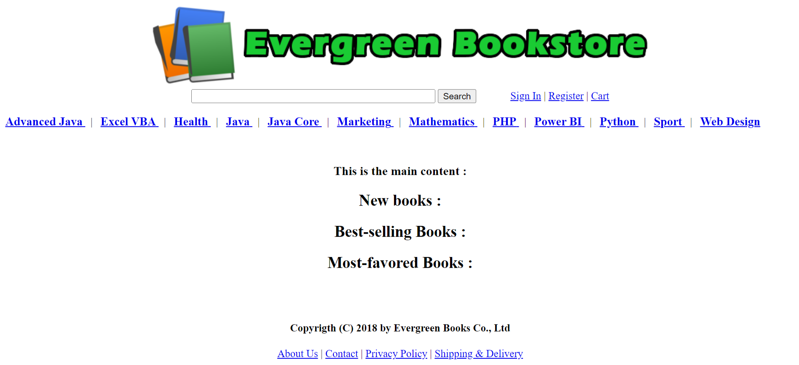
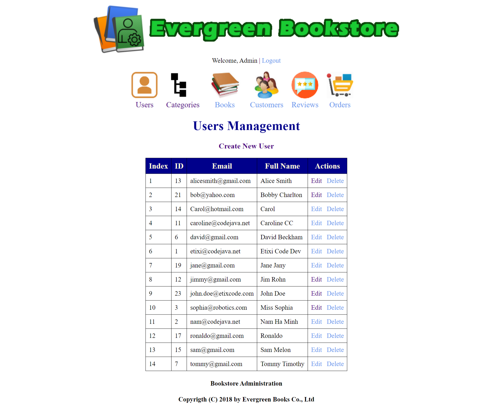
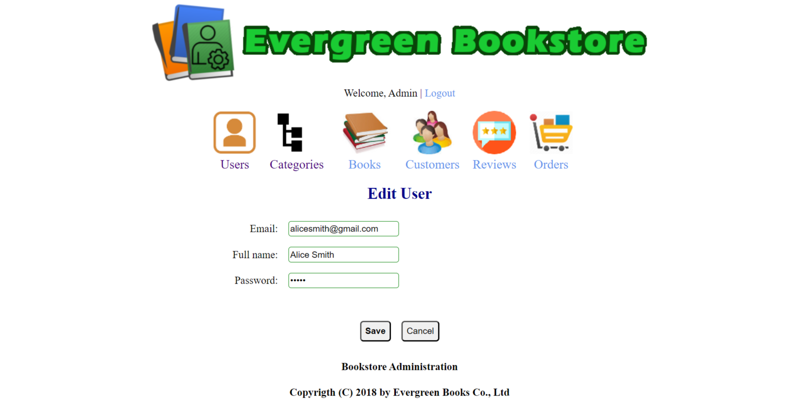
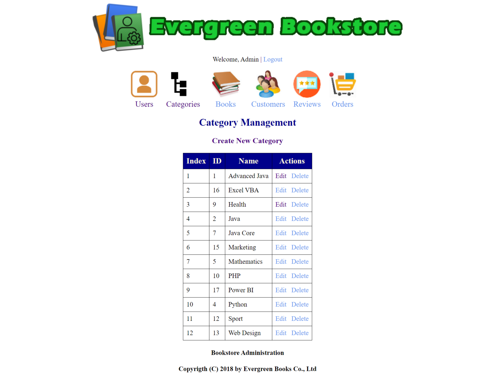
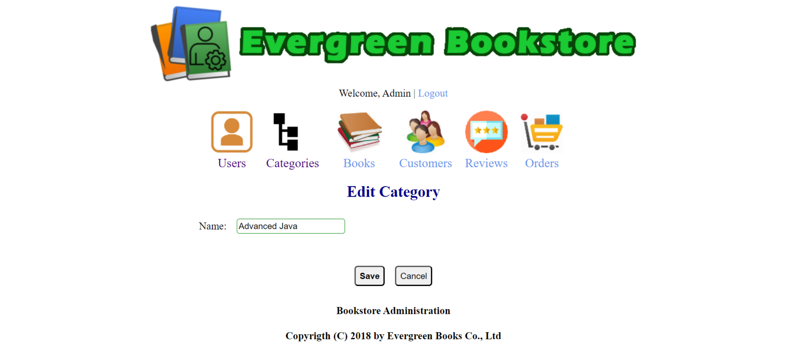
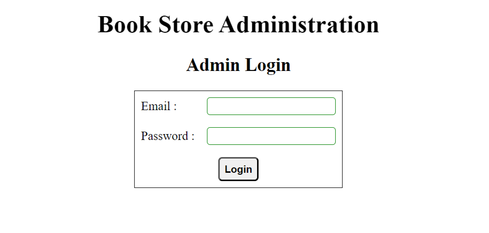
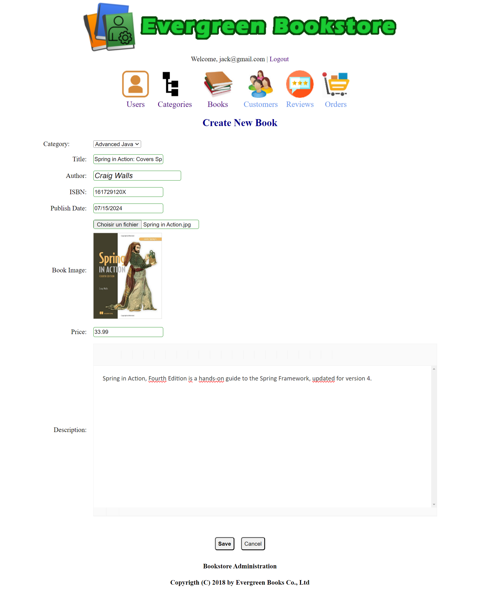

# JAVA SERVLET ET HIBERNATE

Création d'un Site Web de librairie fonctionnelle de code avec servlet Java et framework Hibernate. Développement full-stack. 

# Page d'accueil

# Page d'accueil de l'administrateur

# Module de gestion des utilisateurs - Fonction Lister et Créer les utilisateurs

# Module de gestion des catégories

# Authentification pour l'administrateur

# Gestion des livres - Implémenter la fonctionnalité Lister les livres

# Gestion des livres - Implémenter la fonctionnalité Créer des livres
